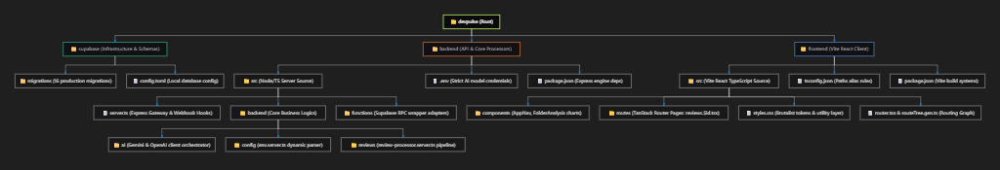

# DevPulse — Complete Master Context Document

> Everything about the product in one place.
> Use this as context for any AI conversation, pitch, or development session.

---



---

## TABLE OF CONTENTS

1. [What DevPulse Is](#1-what-devpulse-is)
2. [The Problem It Solves](#2-the-problem-it-solves)
3. [Who It Is For](#3-who-it-is-for)
4. [The One-Line Pitch](#4-the-one-line-pitch)
5. [How It Works — Full User Journey](#5-how-it-works--full-user-journey)
6. [All Features — Complete List](#6-all-features--complete-list)
7. [GitHub App Integration — How It Connects](#7-github-app-integration--how-it-connects)
8. [Commit Watcher — The Unique Feature](#8-commit-watcher--the-unique-feature)
9. [AI Review Pipeline — How the Review Works](#9-ai-review-pipeline--how-the-review-works)
10. [Production Shield — What It Checks](#10-production-shield--what-it-checks)
11. [Stack-Aware Review — The .devpulse.json Config](#11-stack-aware-review--the-devpulsejson-config)
12. [AI Editor — Phase 3](#12-ai-editor--phase-3)
13. [API and Backend Analyser — Phase 4](#13-api-and-backend-analyser--phase-4)
14. [Team Intelligence Features](#14-team-intelligence-features)
15. [Tech Stack — Every Tool and Why](#15-tech-stack--every-tool-and-why)
16. [Database Schema — All Tables](#16-database-schema--all-tables)
17. [Folder Structure](#17-folder-structure)
18. [API Reference — All Endpoints](#18-api-reference--all-endpoints)
19. [Pricing](#19-pricing)
20. [Competition — DevPulse vs CodeRabbit](#20-competition--devpulse-vs-coderabbit)
21. [USPs — Why DevPulse Wins](#21-usps--why-devpulse-wins)
22. [Design System — Colors, Fonts, Animations](#22-design-system--colors-fonts-animations)
23. [Security Model](#23-security-model)
24. [Failure Modes and Graceful Degradation](#24-failure-modes-and-graceful-degradation)
25. [Architecture Decisions — Why Each Choice](#25-architecture-decisions--why-each-choice)
26. [Business Model and Unit Economics](#26-business-model-and-unit-economics)
27. [Roadmap — Phase by Phase](#27-roadmap--phase-by-phase)
28. [What Appears in GitHub](#28-what-appears-in-github)
29. [Email Delivery — What the Developer Receives](#29-email-delivery--what-the-developer-receives)
30. [AI Model Strategy](#30-ai-model-strategy)

---

## 1. What DevPulse Is

DevPulse is an AI-powered code review SaaS that connects to your GitHub account and automatically reviews every pull request and every commit the moment it happens. It is built specifically for developers and engineering teams who want production-quality code reviews without needing a senior engineer available for every PR.

The core difference from everything else that exists: **DevPulse knows your actual codebase**. Not just the diff. It reads your framework, your folder structure, your team's rules, and reviews code in the context of how you actually build — not generic best practices that may not apply to you.

It is built India-first. Pricing is in INR. Payments via Razorpay and UPI. No per-seat math. No USD conversion.

---

## 2. The Problem It Solves

### The real problem is not that code review doesn't happen. It's that it happens poorly.

Every engineering team has some version of this experience:

- Junior developer pushes code. PR gets approved after a quick scan. Looks fine. Gets merged.
- Three days later: database CPU at 95%. API timing out. Users reporting issues.
- Root cause: an N+1 query pattern inside a loop that was right there in the diff. Nobody caught it.

Or:

- Developer pushes a hotfix directly to main at 11pm on a Friday. No PR. No review.
- Monday morning: 3 customers can't complete checkout. A null check was removed in that hotfix.

Or:

- Team uses CodeRabbit. It reviews the diff. Says 12 things — mostly variable naming and missing semicolons.
- Says nothing about the new API route with no authentication middleware.
- Says nothing about the missing DB index on the new foreign key column.
- Says nothing because it only reviews what's there, not what's absent.

### Why existing AI tools fail

Existing AI code review tools (CodeRabbit, GitHub Copilot PR, etc.) have one fundamental design flaw: they review the diff in isolation. They don't know:

- What framework you use (Next.js App Router vs Pages Router vs Express)
- Where your business logic is supposed to live
- What your validation library is (Zod, Joi, Yup)
- What your team's folder contract is
- What your production requirements are (auth on all routes? rate limiting? error handling?)

So they give generic advice. Sometimes wrong for your setup. Always missing the architectural issues.

---

## 3. Who It Is For

| User type | Their pain | How DevPulse solves it |
|---|---|---|
| Solo developer / indie hacker | No reviewer. Ships bugs nobody catches. | AI senior engineer available 24/7 for ₹0 |
| Startup CTO (3–10 engineers) | Team too small for dedicated code review bandwidth | Every PR reviewed before merge, automatically, specific to their stack |
| Junior / bootcamp developer | Gets PRs approved but ships bad patterns. Never learns why. | Each review teaches the right pattern — specific, with file and line |
| Freelancer | Clients ask "is this production ready?" and they can't prove it | Shareable review report with score — "here's the proof" |
| Dev agency | Code quality varies by developer. No consistency. | Team analytics show recurring patterns. Auto-generates team standards. |

---

## 4. The One-Line Pitch

> **"CodeRabbit reviews your diff. DevPulse reviews your entire engineering process."**

Or for India-specific context:

> **"AI code review that knows your codebase — not just your diff. Built for Indian dev teams. ₹499/month."**

---

## 5. How It Works — Full User Journey

```
Step 1: Sign in with GitHub
        ↓ Supabase Auth GitHub OAuth
        ↓ User row created, GitHub token stored (encrypted)

Step 2: Install GitHub App
        ↓ User clicks "Connect GitHub" → github.com/apps/devpulse/installations/new
        ↓ User selects which repos to connect
        ↓ GitHub redirects back with installation_id
        ↓ Stored in github_installations table

Step 3: (Optional) Add .devpulse.json to your repo
        ↓ Tells DevPulse your framework, folder rules, production gates
        ↓ Without this: generic (but still good) reviews
        ↓ With this: reviews specific to your exact setup

Step 4: Developer opens a PR on GitHub
        ↓ GitHub fires webhook to /api/github/webhook
        ↓ Route verifies HMAC signature → returns 200 immediately
        ↓ Inserts review row (status: pending) into Supabase

Step 5: Supabase Edge Function runs (async, non-blocking)
        ↓ Fetches PR diff via GitHub API (installation token)
        ↓ Triages files: skips package-lock, SVGs, dist/, migrations
        ↓ Runs deep AI review with Gemini 2.5 Flash
        ↓ Applies production gate checks
        ↓ Generates structured JSON findings

Step 6: Results delivered — 4 ways simultaneously
        ↓ Inline PR comments posted to GitHub (grouped as one review)
        ↓ Check Run badge updated: ✅ Score 84/100 · 2 issues
        ↓ Email sent to PR author (no DevPulse account needed)
        ↓ Dashboard updated via Supabase Realtime (live, no polling)

Step 7: Developer sees findings
        ↓ In GitHub: inline comments with one-click "Apply suggestion" blocks
        ↓ In email: score, top issues, link to full report
        ↓ In DevPulse dashboard: full findings, severity breakdown, shareable link

Step 8: (Commit Watcher path — separate flow)
        ↓ Developer pushes commit to watched branch (no PR needed)
        ↓ GitHub fires push webhook
        ↓ Redis lookup: is this repo+branch in watched_repos?
        ↓ If yes: same pipeline runs on the commit diff
        ↓ Commit comment posted on GitHub
        ↓ Email sent to committer
```

Total time from PR open to review delivered: **under 30 seconds**.
Code the user has to write: **zero**.
Setup time: **3 minutes**.

---

## 6. All Features — Complete List

### 🚢 MVP (Phase 1 — shipping first)

| Feature | What it does |
|---|---|
| **PR auto-review** | GitHub App triggers on every PR open. Full AI review in under 30s. |
| **Commit Watcher** | Toggle per repo + branch. Every commit reviewed, not just PRs. |
| **On-demand review** | Paste any GitHub PR URL → instant review in dashboard. No App needed. |
| **Inline PR comments** | Findings posted to GitHub as a single PR Review (one notification). |
| **Check run badge** | ✅/❌ badge on every PR. Score + issue count visible in PR header. |
| **Email to PR author** | Structured report sent to whoever opened the PR. No DevPulse account needed. |
| **Real-time dashboard** | Supabase Realtime pushes review status live — no polling. |
| **Review history** | Full paginated list of all PR and commit reviews. Filterable. |
| **Public share links** | Every review has a read-only shareable URL (12-byte random token). |
| **GitHub App** | One install covers all selected repos. 15,000 req/hr. Bot identity. |
| **Razorpay billing** | INR pricing, UPI, cards, net banking. Free/Pro/Team plans. |

### 📦 v2 (Phase 2 — after MVP is stable)

| Feature | What it does |
|---|---|
| **Stack-aware review** | .devpulse.json config file makes reviews specific to your exact stack |
| **Production Shield** | Checks what's absent — missing auth, rate limits, try/catch, indexes |
| **Auto-label PRs** | GitHub labels: needs-review, critical-issues, devpulse-approved |
| **Re-review on push** | New commits on open PR trigger review of only changed files |
| **Team health analytics** | Score trends, recurring issue charts, developer improvement tracking |
| **Auto standards doc** | After 30 reviews, generates DEVPULSE_STANDARDS.md and opens a PR |
| **Slack notifications** | Review results posted to your channel. Configurable severity threshold. |

### 🔮 v3 (Phase 3 — AI editor)

| Feature | What it does |
|---|---|
| **AI editor panel** | Monaco Editor (VS Code engine) opens on the flagged file with highlighted line |
| **Inline fix chat** | Chat with AI about any specific finding with full context pre-loaded |
| **Generate fix** | AI rewrites the flagged function. Shows before/after diff. One-click accept. |
| **Generate tests** | Writes Jest/Vitest tests targeting the exact edge cases flagged |
| **Generate docstring** | TSDoc with @param, @returns, @throws, @example |
| **Explain in depth** | Why this issue matters, with real production incident examples |

### 🔮 v4 (Phase 4 — API analyser)

| Feature | What it does |
|---|---|
| **OpenAPI import** | Upload swagger.json or openapi.yaml → full endpoint analysis |
| **Production readiness score** | A–F grade per endpoint: auth, rate limiting, validation, error shapes, pagination |
| **Load simulation** | Simulate 1k/10k/100k users. Shows which endpoints bottleneck first and why. |
| **Security scan** | OWASP Top 10 per endpoint. Auth gaps, injection, CORS misconfig. |
| **DB query analyser** | Prisma schema + slow query log → N+1, missing indexes, over-fetching |
| **Jira/Linear sync** | Critical findings become tickets automatically with diff link |
| **Custom rule engine** | Write "always flag X" rules in plain English. Zero false negatives on your rules. |

---

## 7. GitHub App Integration — How It Connects

### Why GitHub App and not OAuth App

| | OAuth App | GitHub App |
|---|---|---|
| Webhooks | Must register per-repo (breaks at scale) | One webhook for ALL repos in installation |
| Rate limit | 5,000/hr per user | 15,000/hr per installation |
| Survivability | Dies if user leaves org | Persists — app is the actor |
| Token security | Never expire (huge risk) | Auto-rotate every 1hr |
| Identity | Acts as the user | Acts as "DevPulse Bot" |
| Permissions | Broad | Fine-grained — users trust it more |

### Permissions DevPulse requests

```
Contents:       Read           ← fetch PR diffs
Pull requests:  Read & Write   ← post comments, submit reviews
Checks:         Read & Write   ← create check run badges
Metadata:       Read           ← mandatory
Issues:         Read & Write   ← add severity labels
```

Minimum permissions requested. Every extra permission reduces install conversion rate.

### Authentication flow (two-step)

```
1. Generate short-lived JWT (10min) signed with GITHUB_PRIVATE_KEY
   - iss: GITHUB_APP_ID
   - iat: now - 60s (clock skew buffer)
   - exp: now + 600s

2. Exchange JWT for installation token (1hr)
   POST /app/installations/{installation_id}/access_tokens
   Authorization: Bearer {JWT}
   → returns { token: "ghs_...", expires_at: "..." }

SDK (@octokit/auth-app) handles both steps automatically.
Token is rotated before expiry. No manual rotation needed.
```

### Webhook events subscribed to

```
pull_request              → opened, synchronize, reopened
push                      → for commit watcher
installation              → created, deleted
installation_repositories → added, removed
```

### Webhook security

Every webhook verified with HMAC-SHA256 constant-time comparison before processing:

```typescript
const expected = 'sha256=' + createHmac('sha256', GITHUB_WEBHOOK_SECRET)
  .update(body).digest('hex')

// Constant-time compare prevents timing attacks
const valid = timingSafeEqual(Buffer.from(sig), Buffer.from(expected))
```

Route always returns 200 immediately. All processing happens async after the response. GitHub expects a response within 10 seconds — we never block it.

---

## 8. Commit Watcher — The Unique Feature

### What it is

The only AI code review tool with a visual UI for per-branch commit monitoring. Every commit pushed to a watched branch gets reviewed — not just PRs.

### Why it matters

Most teams have at least one of these situations:
- Hotfixes pushed directly to `main` bypassing the PR process
- Direct commits to `develop` for "quick changes"
- Small teams where PRs feel like overhead for trivial changes
- Critical branches that must be protected even if someone bypasses process

None of these get reviewed by any existing tool. The Commit Watcher covers them all.

### How users configure it

The Watched Repos page in the dashboard shows all connected repos:

```
┌─────────────────────────────────────────────────────┐
│ devpulse/web               [main] [develop]  ● live │
│ Notify if severity: HIGH or above               [ON]│
│ Last reviewed: 4 min ago · 2 issues found           │
├─────────────────────────────────────────────────────┤
│ devpulse/payment-api       [main]            ● live │
│ Notify if severity: MEDIUM or above             [ON]│
│ Last reviewed: 1 hr ago · 0 issues                  │
├─────────────────────────────────────────────────────┤
│ devpulse/infra             [main]            ○ off  │
│ Click to enable commit watching                 [OFF]│
└─────────────────────────────────────────────────────┘
```

Config options per repo:
- Which branches to watch (multiselect)
- Minimum severity to notify (low / medium / high / critical)
- Notify via email (on/off)
- Post commit comment on GitHub (on/off)

### How it works technically

```
Push event arrives at /api/github/webhook
        ↓
Extract branch from ref: "refs/heads/main" → "main"
        ↓
Redis lookup (1ms): is this repo + branch in watched_repos where enabled = true?
        ↓ (if yes)
Skip if it's a merge commit (commit message starts with "Merge")
Skip if diff is empty (e.g. tag push)
        ↓
Insert commit_review row (status: pending)
Invoke Supabase Edge Function: process-commit-review
        ↓
Edge Function:
  - Fetch commit diff via GitHub API
  - Same triage pipeline as PR reviews
  - AI review with Gemini 2.5 Flash
  - Store findings in commit_reviews table
  - Post commit comment on GitHub (if enabled)
  - Send email to committer (if severity ≥ threshold)
  - Update status → complete
  - Realtime fires → dashboard updates
```

---

## 9. AI Review Pipeline — How the Review Works

The pipeline is designed to give the best quality review at the lowest possible cost. CodeRabbit's secret isn't their models — it's their pipeline. DevPulse builds the same pipeline.

### Step-by-step pipeline

```
For each changed file in the PR or commit:

STEP 1: Pattern triage (free — no LLM, instant)
  Check filepath against: package-lock.json, yarn.lock, *.svg, *.png,
  dist/**, build/**, *.min.js, generated.ts, migrations/**
  → SKIP if trivial (catches ~80% of trivial files at zero cost)

STEP 2: LLM triage — GPT-4.1 Nano (~₹0.00002/file)
  Prompt: "Is this diff trivial? Reply only: TRIVIAL or REVIEW"
  → SKIP if TRIVIAL (saves 30–40% of expensive model calls)
  → REVIEW if it contains actual logic changes

STEP 3: Prompt cache check
  System prompt = ~3,000 tokens (stack config + folder contract + production rules)
  Cached at 90% discount (Anthropic) or implicitly (Gemini)
  Cache hit rate in production: ~95%
  Effective cost: ₹0.00003 per call instead of ₹0.0003

STEP 4: Deep review — Gemini 2.5 Flash (~₹0.015/file)
  Inputs:
    - Compressed diff (whitespace stripped, blank lines removed)
    - Stack context from .devpulse.json
    - Folder contract rules
    - Production gate checklist
  Output: structured JSON (never free text — prevents parsing errors)
  {
    score: 0-100,
    severity: "low|medium|high|critical",
    summary: string (max 100 chars),
    findings: [{
      file, line, type, severity, description (max 25 words), suggestion (max 40 words)
    }]
  }

STEP 5: PR summary — Gemini 2.5 Flash (1M context, no chunking)
  Entire PR diff sent in one call (Gemini's 1M context fits any normal PR)
  Output: overall summary, positives list, final severity verdict, PR score

STEP 6: Similarity cache — Upstash Redis (24hr TTL)
  Key: sha256(repo + filepath + diff.slice(0, 200))
  Cache hit → return cached findings (free, instant)
  Saves ~20% of API costs on iterative commits to open PRs
```

### Cost per review

| Scenario | API cost |
|---|---|
| Average PR (8 files, 300 lines) | ₹0.018 |
| Large PR (30 files, 1000 lines) | ₹0.06 |
| Small commit (2 files, 50 lines) | ₹0.004 |
| Trivial diff (only lockfiles, SVGs) | ₹0.00002 (triage only) |

---

## 10. Production Shield — What It Checks

The Production Shield is what separates DevPulse from all other tools. It checks **what's absent** — the missing things that cause 3am incidents. Not just what's in the diff.

### Security gates
- New API route with no auth middleware check
- SQL/NoSQL injection: user input directly interpolated in query string
- Hardcoded secrets or API keys present in diff
- JWT verification bypass patterns
- CORS wildcard (`*`) on non-public routes
- Missing input sanitisation before HTML render (XSS risk)
- Insecure direct object references (user can access any ID)
- Path traversal via user-controlled file paths
- SSRF via user-controlled URL parameters
- Missing authentication check entirely on admin/sensitive routes

### Reliability gates
- `async` function with no `try/catch`
- External API call with no timeout option set
- No retry logic on network operations
- `Promise.all` with no error boundary
- DB transaction with no rollback handler
- Webhook handler that blocks instead of returning 200 immediately
- `setTimeout` or `setInterval` that is never cleared
- Event listener added but never removed (memory leak)

### Architecture gates (from .devpulse.json)
- Business logic directly in a route handler (should be in services layer)
- New file created in wrong folder per declared folder contract
- Import from wrong layer (UI component importing from DB layer)
- Missing Zod validation on new request handler
- New FK column in migration with no corresponding index

### Performance gates
- DB query inside a loop (N+1 pattern)
- Missing pagination on new list endpoint
- Synchronous file system operation in request path
- `useEffect` with missing or incorrect dependency array
- `SELECT *` instead of specific columns
- No caching on expensive repeated queries
- Large payload returned with no field selection

---

## 11. Stack-Aware Review — The .devpulse.json Config

This is the feature no competitor has. A config file in the repo root that tells DevPulse exactly how you build — so reviews are relevant to your architecture, not generic.

### Example config

```json
{
  "stack": {
    "framework": "nextjs-15-app-router",
    "auth": "supabase",
    "database": "supabase-postgres",
    "orm": "prisma",
    "validation": "zod",
    "styling": "tailwind",
    "payments": "razorpay",
    "cache": "upstash-redis"
  },
  "folderContract": {
    "features": "domain feature modules — components, hooks, actions, types. Business logic lives here.",
    "lib": "pure utility functions only. No business logic. No side effects. No DB calls.",
    "components/ui": "stateless presentational components only. No Supabase calls.",
    "app/api": "thin route handlers only. Validate input then delegate to features/*/actions/."
  },
  "productionGates": {
    "requireAuthOnNewRoutes": true,
    "requireRateLimitOnPublicMutations": true,
    "requireZodValidation": true,
    "requireTryCatchOnAsync": true,
    "requireIndexOnNewForeignKeys": true,
    "maxFunctionLines": 50,
    "requireErrorBoundaryOnPages": true
  },
  "ignorePatterns": [
    "**/*.test.ts",
    "**/*.spec.ts",
    "migrations/**",
    "*.generated.ts"
  ]
}
```

---

## 12. AI Editor — Phase 3

A split-pane experience embedded in the review detail page. Removes all friction between "seeing a problem" and "fixing the problem."

### Layout

```
┌─────────────────────────────────┬──────────────────────┐
│ Monaco Editor (VS Code engine)  │  AI Chat Panel        │
│                                 │                       │
│ src/lib/db.ts                   │  You have an N+1      │
│                                 │  query pattern on     │
│  23  async function getUsers()  │  line 34.             │
│  24    const users = await db   │                       │
│  25    users.forEach(async u => │  This loops over      │
│► 26      await db.posts.find    │  every user and       │
│  27        ({ userId: u.id })   │  queries the DB       │
│  28    })                       │  once per user.       │
│  29  }                          │  At 100 users:        │
│                                 │  101 DB queries.      │
├─────────────────────────────────│                       │
│ [Generate fix] [Gen test]       │  [Chat input...]      │
│ [Explain] [Dismiss]             │                       │
└─────────────────────────────────┴──────────────────────┘
```

---

## 13. API and Backend Analyser — Phase 4

The only dedicated API production-readiness analyser in the code review space. No competitor has this as a feature.

### Input methods

| Method | How |
|---|---|
| Upload OpenAPI spec | Upload `swagger.json` or `openapi.yaml` directly |
| Paste routes file | Paste your Express routes/index.ts, Next.js API listing |
| Connect GitHub repo | Point at a repo, auto-crawls route files. Re-analyses on changes. |
| Import Postman collection | Upload Postman collection JSON |

---

## 14. Team Intelligence Features

Available in v2. Designed for CTOs, engineering managers, and team leads.

### Team Health Dashboard

After enough reviews accumulate, the Team Health page shows:

- **Score trend chart** — team average review score over 30/60/90 days
- **Top recurring issues** — bar chart of most common finding categories
- **Category breakdown** — Security vs Performance vs Architecture vs Reliability
- **Most improved developer** — who improved most this month (opt-in only)
- **Comparison vs last month** — are we getting better?

---

## 15. Tech Stack — Every Tool and Why

### Frontend

| Tool | Why |
|---|---|
| **Vite / React client** | Quick compilation, zero overhead, single-page application structure for seamless dashboard interactions. |
| **Tailwind CSS v4** | Utility-first, clean variables, custom theme tokens. |
| **Framer Motion** | Restrained micro-animations, skeleton expansions, and list entry visual effects. |
| **Radix UI / shadcn/ui** | Headless primitives for customizable and accessible popovers, dialogs, and controls. |

### Backend / Data

| Tool | Why |
|---|---|
| **Node.js Express Server** | Standard backend API endpoint controller. Serves lightweight JSON payloads and coordinates background workers. |
| **Supabase Client / Postgres** | Houses relational tables, reviews, and transaction details securely with Row-Level Security policies. |
| **Supabase Realtime** | Subscribes users to active review analysis statuses instantly without repeated REST pulling. |
| **Deno / Supabase Edge Functions** | Safe, auto-scaling execution context for intensive code parsing pipelines. |

### Infrastructure

| Tool | Why |
|---|---|
| **Upstash Redis** | Sub-millisecond read speeds. Performs key bucket rate limiting and similarity caches. |
| **Resend** | Dispatches engineering diagnostic score sheets directly to committer/author inboxes. |

---

## 16. Database Schema — All Tables

### `users`
```sql
id UUID PRIMARY KEY,
email TEXT UNIQUE,
name TEXT,
avatar_url TEXT,
github_id BIGINT UNIQUE,
github_login TEXT,
github_token TEXT,  -- encrypted with pgcrypto
plan TEXT DEFAULT 'free',  -- free|pro|team
stripe_customer_id TEXT,
created_at TIMESTAMPTZ
```

### `teams`
```sql
id UUID PRIMARY KEY,
name TEXT,
slug TEXT UNIQUE,
plan TEXT DEFAULT 'free',
created_at TIMESTAMPTZ
```

### `reviews` (PR reviews)
```sql
id uuid primary key default gen_random_uuid(),
user_id uuid references profiles(id),
repo text,
pr_number int,
pr_url text,
status text default 'pending',
health_score int,
summary text,
error_message text,
created_at timestamptz default now()
```

### `findings`
```sql
id uuid primary key default gen_random_uuid(),
review_id uuid references reviews(id) on delete cascade,
severity text,
category text,
title text,
description text,
file_path text,
line_start int,
line_end int,
bad_code text,
suggested_fix text,
confidence int,
created_at timestamptz default now()
```

---

## 17. Folder Structure

```
devpulse/
├── backend/                             Express engine & AI handlers
│   ├── src/
│   │   ├── backend/
│   │   │   ├── ai/                      Gemini & OpenAI client orchestrators
│   │   │   ├── config/                  env.server.ts dynamic configuration resolver
│   │   │   ├── email/                   SMTP / Resend diagnostic email senders
│   │   │   ├── github/                  GitHub App hook managers
│   │   │   ├── http/                    CORS & Express middleware
│   │   │   ├── logging/                 Winston console debug logging
│   │   │   └── reviews/                 Core PR pipeline handlers
│   │   ├── functions/                   Supabase RPC adapters
│   │   └── server.ts                    Express Gateway listening on PORT 5000
│   └── package.json
│
├── frontend/                            Vite React single page client
│   ├── src/
│   │   ├── components/                  AppNav, ThemeToggles, loaders, skeletons
│   │   │   └── ui/                      shadcn components (owned code)
│   │   ├── integrations/                Supabase client connection points
│   │   ├── lib/                         api-client.ts, auth.tsx global states
│   │   ├── routes/                      reviews.$id.tsx TanStack routing files
│   │   ├── styles.css                   Custom styling tokens
│   │   └── main.tsx
│   └── package.json
│
└── supabase/                            Local database schemas & migrations
    ├── migrations/                      16 production-grade relational migrations
    └── config.toml
```

---

## 18. API Reference — All Endpoints

```
PR Reviews
  POST   /api/reviews/process      → Run review process (background worker)
  POST   /api/reviews/create       → Create a new review job (unclaimed or tracked)
  POST   /api/reviews/retry        → Purge and restart analysis from scratch
  POST   /api/reviews/apply-fix    → Apply AI suggestion and push commit directly to branch

Payments
  POST   /api/pricing/razorpay/checkout → Create secure INR order with billing cycle info
  POST   /api/pricing/razorpay/verify   → Cryptographically verify transaction & upgrade user

User Operations
  POST   /api/reviews/user-profile → Retrieve credentials, limits, and team statistics
```

---

## 19. Pricing

| Plan | Monthly | PR Reviews | Repos | Team members |
|---|---|---|---|---|
| **Free** | ₹0 | 5/mo | 1 | 1 |
| **Pro** | ₹499 | 100/mo | 10 | 1 |
| **Team** | ₹1,499 | 500/mo | Unlimited | 10 |

---

## 20. Competition — DevPulse vs CodeRabbit

- **INR Billing & UPI Support:** CodeRabbit charges flat USD ($24/seat) with heavy currency conversion fees. DevPulse offers clean INR billing with standard UPI (Google Pay, PhonePe, Paytm).
- **Commit Watcher:** CodeRabbit only acts on PR diffs. DevPulse provides active branch monitoring, evaluating raw hotfixes committed directly.
- **Production Shield:** DevPulse actively audits *absent features* — missing authentication blocks, rate limits, indices, and error wrappers — which CodeRabbit misses entirely.

---

## 21. USPs — Why DevPulse Wins

1. **Stack-Aware Architecture Context:** Evaluates codebases with complete folder mapping configurations rather than isolated lines.
2. **Missing Feature Audit (Production Shield):** Highlights safety features that developers forgot to write before merging.
3. **Optimized Multi-Triage Pipeline:** Leverages an inexpensive file validator structure to maintain sub-cent execution rates.

---

## 22. Design System — Colors, Fonts, Animations

DevPulse utilizes a high-fidelity **Developer-Brutalist** design system inspired by top developer tools like Linear, Vercel, and Railway.

### Typography
- **Display + Body:** `Space Grotesk` (tight tracking for headers, clean reading sizes for text blocks).
- **Code + Metadata:** `JetBrains Mono` (ideal for paths, indices, numbers, and pills).

### Colors (Curated HSL Tokens)
- **Base Background:** `#0A0A0B` (Dark), `#FAFAF9` (Light)
- **Accent Theme (Default):** Lime Green (`#BEF264` / `#84CC16`)
- **Severity Levels:**
  - `CRIT`: Red (`#FB7185`)
  - `HIGH`: Orange (`#FB923C`)
  - `MED`: Yellow (`#FBBF24`)
  - `LOW`: Blue (`#60A5FA`)

---

## 23. Security Model

- **Row-Level Security (RLS):** Every Supabase query is protected at the database tier using authenticated user IDs.
- **Webhook Verifications:** GitHub and Razorpay webhook requests are cryptographically verified using SHA-256 HMAC signatures before running.
- **Dynamic Credential Handling:** High-privilege tokens are loaded exclusively at runtime via safe backend process environments and never exposed to the client bundle.

---

## 24. Failure Modes and Graceful Degradation

| Point of Failure | System Safeguard | User Visibility |
|---|---|---|
| AI API Outage | Edge Function updates row status to `'failed'` cleanly | "Review failed: The AI provider is temporarily unavailable. Please retry." |
| Database Timeout | Execution boundary capped at 150s with rollback | Real-time panel reports failure and unlocks retry triggers |
| Billing API Down | Fallback check logs pending transactions asynchronously | Displays processing verification banner without locking workspace |

---

## 25. Architecture Decisions — Why Each Choice

- **Express + Vite Architecture:** Isolates UI bundles from performance-critical background tasks. Express handles the webhooks, Razorpay signatures, and Edge worker coordination, while the Vite SPA keeps client interaction lightweight.
- **Upstash Redis Caching:** Keeps token buckets and PR diff lookups sub-millisecond, removing database connection overhead from high-frequency checks.

---

## 26. Business Model and Unit Economics

- **Ultra-low Operating Cost:** A multi-layered triage system (pattern filter + GPT Nano gate) isolates expensive LLM reviews from minor structural files. Average review costs are kept under **₹0.015 per pull request**, allowing the free tier to scale with high sustainable margins.
- **INR Subscription Strategy:** Zero-friction Razorpay checkouts designed to bypass international USD restrictions for Indian start-up workspaces.

---

## 27. Roadmap — Phase by Phase

- **Phase 1 (MVP):** High-speed webhook reviews, commit watcher branch toggles, and unified inline suggestions.
- **Phase 2 (Teams):** Stack contract validations (`.devpulse.json`), auto-generated coding standards, and Slack integration loops.
- **Phase 3 (AI Editor):** Monaco splits, direct patch edits, and automated test generators.
- **Phase 4 (API Analyser):** Load projections, API health grades, linear trackers, and OWASP scanners.

---

## 28. What Appears in GitHub

- **Inline Suggestion Code Fences:** Multi-line code diff structures that appear as clear, one-click `Apply suggestion` blocks directly in the GitHub PR review feed.
- **Status Check Badges:** Visual `Check Runs` indicating code diagnostic grades (e.g. `Score: 84/100 · 2 critical issues`) inside build checks.

---

## 29. Email Delivery — What the Developer Receives

- **Diagnostic Performance Score Card:** A professional engineering summary with health grades, issue counts, and visual HSL sparklines.
- **Direct Access Report URL:** A single, secure shareable link allowing engineering partners to view specific issues without registering an account.

---

## 30. AI Model Strategy

- **GPT-4.1 Nano:** Performs lightning-fast file evaluations to triage and filter out trivial changes before invoking large workers.
- **Gemini 2.5 Flash:** Acts as the primary diagnostic engine due to its massive 1M token context window, analyzing complete diff packages at minimal execution costs.
- **Claude Haiku & Sonnet:** Selected dynamically for premium enterprise plans requiring advanced security scanning routines.
